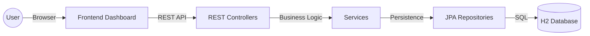
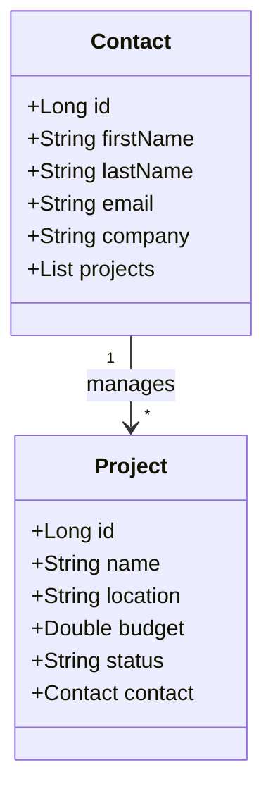

# ConstructFlow | Construction Project Management System

Hey Scott! Here's the repository for the construction management app we discussed. I've built this as a robust foundation for managing commercial project data and stakeholder relationships.

For our junior developers: This is a **Spring Boot 3** application paired with a modern **Vanilla JS/CSS** frontend. It demonstrates clean architecture, JPA relationships, and RESTful API design.

---

## 🏗️ Architecture Overview

The system follows a standard N-Tier architecture to ensure separation of concerns and maintainability.

### Request Flow


### Data Model (One-to-Many)
One `Contact` (Project Manager, Architect, GC) can be associated with multiple `Projects`.



---

## 🚀 Getting Started

### Prerequisites
- **Java 17** or higher
- **Maven 3.8+** (or use the included `./mvnw`)

### Running Locally
1. Clone the repository and navigate to the project:
   ```bash
   cd construction-manager
   ```
2. Start the application:
   ```bash
   ./mvnw spring-boot:run
   ```
3. Access the dashboard:
   Open [http://localhost:8080](http://localhost:8080) in your browser.

---

## 🛠️ Tech Stack & Key Concepts

### Backend
- **Spring Boot 3**: The backbone of the application.
- **Spring Data JPA**: Handles database interactions without writing boilerplate SQL.
- **Lombok**: Reduces verbosity with `@Data`, `@Builder`, and `@NoArgsConstructor`.
- **H2 Database**: An in-memory database for rapid development and zero-config setup.

### Frontend
- **Vanilla JavaScript**: Modern ES6+ for state management and API calls.
- **Vanilla CSS**: A custom design system featuring:
  - **CSS Variables** for easy branding updates.
  - **Glassmorphism** for a premium, modern feel.
  - **Responsive Grid** layouts for dashboarding.

---

## ☁️ Deployment to IBM Cloud

We've optimized this project for **IBM Cloud Code Engine**. You can deploy using Docker or the automated script provided.

### Option 1: Automated Script (Recommended)
We've included a helper script to handle the build and pivot to the cloud:
```bash
chmod +x deploy-ibm.sh
./deploy-ibm.sh [YOUR_RESOURCE_GROUP] [REGION]
```

### Option 2: Docker / Container Registry
1. Build the image:
   ```bash
   docker build -t icr.io/[YOUR_NAMESPACE]/construct-flow:v1 .
   ```
2. Push to IBM Container Registry:
   ```bash
   ibmcloud cr image-push icr.io/[YOUR_NAMESPACE]/construct-flow:v1
   ```
3. Deploy to Code Engine via the IBM Cloud Console using that image.

---

## 💡 Notes for Juniors

- **Entities**: Check `src/main/java/com/construction/manager/model`. Pay attention to how `@OneToMany` and `@ManyToOne` are configured to prevent circular references in JSON using `@JsonIgnore`.
- **Services**: All business logic lives in the `service` package. This keeps the `controller` thin and easy to test.
- **Frontend State**: The `app.js` file manages a small local state for contacts and projects to provide a snappy, SPA-like experience without complex frameworks.

---

Hope this helps, Scott! Let me know if you want to dive deeper into any specific module.

Cheers!
